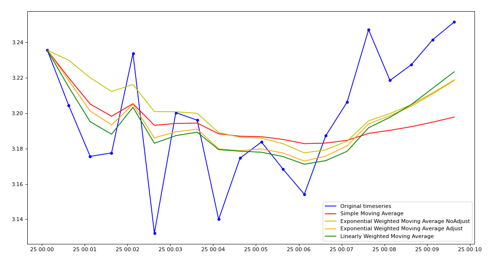
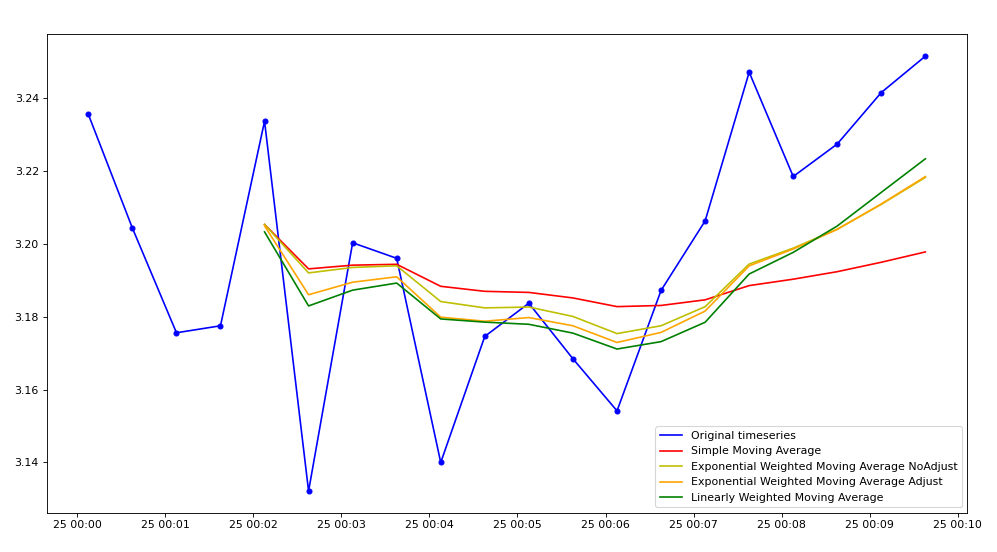
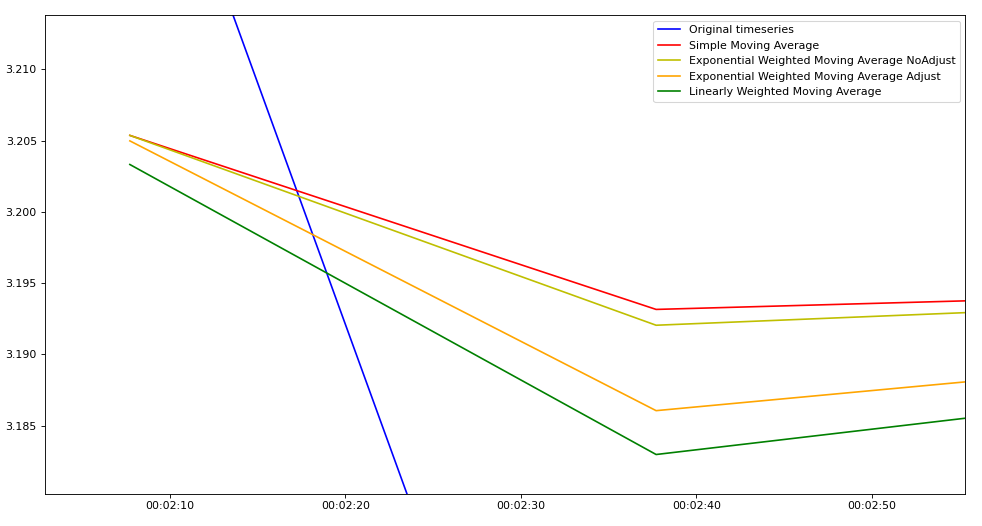

# Moving Averages
Below is shown an example of how the different moving averages perform on the first observations:
```python
min_periods = 1

time_window = '60min'
```

```python
min_periods = 5

time_window = '60min'
```



The moving averages start on the 5th observation since min_periods=5.


Exponential Weighted Moving Average with `adjust=False` or `adjust=True` differ on the first calculated values but gradually end up meeting.
If we zoom in, we can see that the first value for the Exponential Weighted Moving Average with `adjust=False` starts on the 5th Simple Moving Average.
