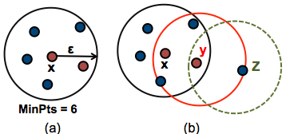

## Density-based Spatial Clustering of Applications with Noise [DBSCAN](https://www.aaai.org/Papers/KDD/1996/KDD96-037.pdf)

### 1. Definition
Density-based clustering algorithm used to identify clusters of varying shape and size with in a data set.

**Why should we use it?**
- Does not require a pre-determined set number of clusters.
- Able to **identify outliers** as noise, instead of classifying them into a cluster.
- Flexible when it comes to the size and shape of clusters, which makes it more useful for messy, real life data.
### 2. Parameters
- **ε** : defines the maximum distance allowed between two points within the same cluster.
- **MinPts** : defines the minimum number of data points required to form a distinct cluster.

### 3. Type of points
Any point x in the data set, with a neighbor count greater than or equal to MinPts, is marked as a core point. We say that x is border point, if the number of its neighbors is less than MinPts, but it belongs to the ϵ-neighborhood of some core point z. Finally, if a point is neither a core nor a border point, then it is called a noise point or an outlier.

The figure below shows the different types of points (core, border and outlier points) using MinPts = 6. Here x is a core point because neighboursϵ(x)=6, y is a border point because neighboursϵ(y)<MinPts, but it belongs to the ϵ-neighborhood of the core point x. Finally, z is a noise point.



### 4. Algorithm
1. Find the points in the ε (eps) neighborhood of every point, and identify the core points with more than minPts neighbors.

2. Find the connected components of core points on the neighbor graph, ignoring all non-core points.
3. Assign each non-core point to a nearby cluster if the cluster is an ε (eps) neighbor, otherwise assign it to noise.

This function makes use of [DBSCAN](https://scikit-learn.org/stable/modules/generated/sklearn.cluster.DBSCAN.html) from the sklearn library.

### 5. Tuning the parameters
**MinPts**:
Rules of thumb for selecting the MinPts value:
- The larger the data set, the larger the value of MinPts should be.
- If the data set is noisier, choose a larger value of MinPts
Generally, MinPts should be greater than or equal to the dimensionality of the data set.
- For 2-dimensional data, use DBSCAN’s default value of MinPts = 4 (Ester et al., 1996).
- If your data has more than 2 dimensions, choose MinPts = 2*dim, where dim= the dimensions of your data set (Sander et al., 1998).

**ε:**
In order to find the best epsilon for your data, we will use [NearestNeighbors](https://ogrisel.github.io/scikit-learn.org/sklearn-tutorial/modules/generated/sklearn.neighbors.NearestNeighbors.html) from sklearn to calculate the average distance between each point and its k nearest neighbors, where k = the MinPts value you selected. If we plot the average k-distances in ascending order on a k-distance graph, you’ll find the optimal value for ε at the point of maximum curvature (i.e. where the graph has the greatest slope). This technique is defined in this [paper](https://iopscience.iop.org/article/10.1088/1755-1315/31/1/012012/pdf).

In order to find the point of maximum curvature we will use the [Knee library](https://pypi.org/project/kneed/).

Ref: [“Finding a “Kneedle” in a Haystack: Detecting Knee Points in System Behavior”. Ville Satopaa et al. 2011](https://raghavan.usc.edu//papers/kneedle-simplex11.pdf).


## Cubic Spline approximation (smoothing) [csaps](https://csaps.readthedocs.io/en/latest/formulation.html#)

### 1. Definition
Cubic smooting spline algorithm proposed by Carl de Boor in A Practical Guide to Splines, Springer-Verlag, 1978.

### 2. Parameters
- **p**: Smoothing parameter within the range [0,1]:

    0: The smoothing spline is the least-squares straight line fit to the data.

    1: The natural cubic spline interpolant.

### 3. Csaps vs scipy
Example plot of comparison between csaps and scipy.UnivariateSpline (k=3) with defaults (auto smoothing):


## Use example (1 input, 3 parameters):

```py
def remove_outliers(data=input_Series,reg_smooth=0.9, time_window=60, del_zero_val= False)
```


The output of the function returns the timeseries without the outliers detected:


## Needs to be implemented
In order to help the user find the best parameters (reg_smooth, time_window) needed in the function it would be a good help to visualize the process.
For this reason, a future implementation of this function will plot and return 4 Series:
1. Timeseries without the outliers detected
2. Outliers detected by dbscan
3. Outliers detected by the regression spline
4. Regression spline

This will also allow to concatenate those outputs with further calculations.


